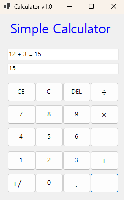
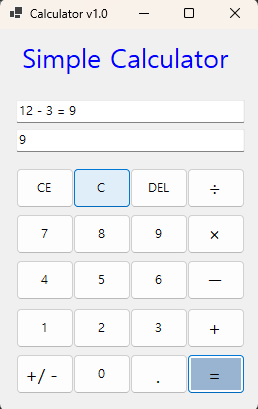
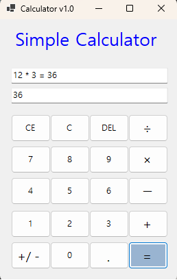
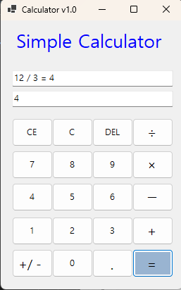
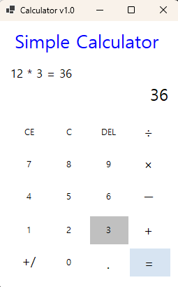

# (C# 코딩) 간단한 계산기 만들기
## 개요
-C# 프로그래밍학습
- 1줄 소개 : 숫자 버튼과 연산자 버튼을 클릭하면 값을 입력받아 수식을 계산해서 결과를 표시해주는 계산기 프로그램
- 사용한 플랫폼 : C#, .NET Windows Forms, Visual Studio, GitHub
- 사용한 컨트롤 : Label, Textbox, Button
## 실행 화면 (과제1)
-과제1 코드의실행스크린샷 

-과제 내용
 -TextBox, Button, Label 등의 UI를 적절히 배치합니다.
 -숫자 입력 기능
 -사칙연산 기능 (덧셈)
 -계산 결과 출력 기능
-구현 내용과 기능 설명
 -숫자 버튼을 누르면 위 아래 텍스트 박스에 숫자가 입력되는 기능 구현
 -숫자 버튼을 누르고 연산자 버튼을 누른뒤 다음 숫자 버튼을 누르면 계산이 실행되고 결과가 출력되는 기능 구현
덧셈을 실행해보는 화면.
## 실행 화면 (과제2)
-과제2 코드의실행스크린샷 

-과제 내용
 -빼기, 곱하기, 나누기 기능 추가
 -이벤트 연결
-구현 내용과 기능 설명
 -빼기, 곱하기, 나누기 버튼을 추가하여 사칙연산 기능을 완성
 -각 버튼에 이벤트를 연결하여 버튼 클릭 시 해당 연산이 실행되도록 구현

## 실행 화면 (과제3)
-과제3 코드의실행스크린샷 
C와CE, DEL 버튼을 구현했지만 따로 스크린샷으로 보여줄 수 없는 기능이라서 생략하겠습니다.
-과제 내용
 -C, CE, DEL 버튼 추가
 -C, CE, DEL 버튼에 기능 구현
-구현 내용과 기능 설명
 -C 버튼을 누르면 모든 입력과 결과가 초기화되는 기능 구현
 -CE 버튼을 누르면 현재 입력 중인 숫자만 초기화되는 기능 구현
 -DEL 버튼을 누르면 현재 입력 중인 숫자의 마지막 자리가 삭제되는 기능 구현
## 실행 화면 (과제4)
-과제4 코드의실행스크린샷

-과제 내용
 -Windows 계산기의 기능 일부 구현
 -보기 좋게 디자인
-구현 내용과 기능 설명
 -깔끔한 디자인으로 계산기를 완성한 화면.
 -소숫점 계산 기능 추가
 -연산자 우선순위 기능 추가
## 배운 내용
- 버튼 여러개를 모두 같은 설정으로 변경하거나 이벤트를 실행시킬 때 드래그로 묶으면 더욱 편리하게 작업할 수 있다는 것을 배웠습니다.
